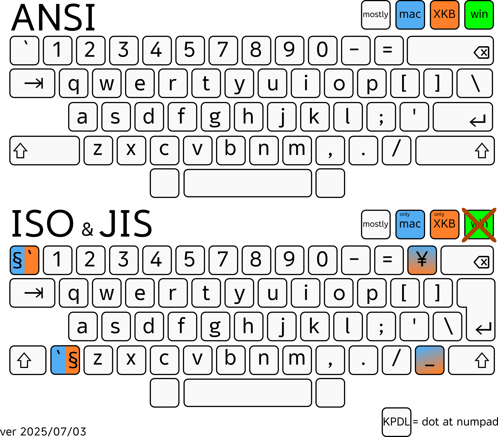

# Kiimo

Modify, and generate keyboard layout from single JSON file. Built with TypeScript.

## Features

- Validate JSON layout (See example files in [`input`](./input))
- Generate layout files
  - `.keylayout` (macOS) *inside `.bundle`*
  - `.klc` (Windows)
  - `.kcm` (Android Physical keyboard)
  - XKB (Linux, BSD, etc)
  - Chrome OS remap extension (Manifest V3)  
    *Note: Alphanumeric shortcut keys still do not work on Chrome OS.*

## Limitations

- **ISO and JIS layouts are not supported on Windows yet:**  
  Kiimo currently does not generate corrected `.klc` files for ISO or JIS layouts, and **Microsoft Keyboard Layout Creator (MSKLC)** cannot compile them properly  
  (e.g., keys such as `¥` and `_` cannot be mapped).

- **One key cannot send multiple codepoints due to compatibility limitations:**  
  For example, plain **XKB** does not support mapping a single key to send multiple characters.  
  See the mailing list thread:  **[(xkb) how to map a key to multiple characters?](https://lists.x.org/archives/xorg/2009-January/042282.html)**  
  For instance, you cannot configure the “A” key to send “aaaaaaaaaa”.

# How to Download Generated Layout(s)

## Download WHOLE repo

- From the project’s main page, click the **Code** button, then **Download ZIP**.
- Extract the ZIP file.
- Locate the `output` folder.
- Find the layout you want.

## Download Only Some Folder?

Want just one folder (e.g. `Manoonchai-ColemakDH.bundle`)?  
GitHub doesn’t support this directly — you’ll have to find your own way. 😉  
<sub>Hint: try searching “download GitHub subdirectory”</sub>

## How to Install `.xkb` Layouts

See installation guide at:  
👉 [https://github.com/hiohlan/mnc](https://github.com/hiohlan/mnc)


# How to Create Your Own Layout

1. Edit an existing JSON file in the [`input`](./input) directory, or add a new one.
2. Some platforms use icons or images; source images are in the [`src`](./src) folder.  
   If you want to use your own icons, create images with the same filenames and **replace the files inside the built output folder after building**.  
   For macOS bundles, you can also configure which icon to use by setting the `icon` field in your JSON config (e.g. "icon": "lana" will use `./src/iconMac/icon_lana.icns`).

### Key in `.json`:

> **Note:** Chrome OS and Android physical keyboard layouts use the **same key mapping format as XKB** (Linux).

# How to Build a Layout

You can build the layout using any compatible runtime.  
In this example, we use [Bun](https://bun.sh):

1. Install dependencies:
   ```
   bun install
   ```
2. Run the CLI:
   ```
   bun run cli
   ```
3. Select a layout from the list.  
   ```
   $ bun run cli
   ? Pick input JSON file › - Use arrow-keys. Return to submit.
     Manoonchai_Lao.json
     Manoonchai-ColemakDH-ZXCVD.json
     Manoonchai-ColemakDH.json
     Manoonchai-JIS.json
     Manoonchai-v0.2.json
     Manoonchai-WittNV.json
   ❯ Manoonchai.json
    ```
4. The generated files will appear in:
    ```
    output/<filename>/
    ```
    where `<filename>` matches the selected JSON file.
5. For **Windows** users:  
   To install the layout on your PC, use **Microsoft Keyboard Layout Creator (MSKLC)** to compile the generated `.klc` file into an installable layout.  

# Changelog

## 2025/08/04a
- Improved 16x16px icon for Mac
- Swap some key for TaiTham

## 2025/08/04
- Fixed: wrong locales ID (`la` -> `lo`).
- Feature: Added support for TaiTham (Lanna, Tai Khuen, Tai Lue).

## 2025/08/03
- Fixed: generated wrong `id` — it included space characters and dots. Now replaced with underscores for compatibility.
- Switched macOS bundle language tag from hardcoded "th" to dynamically use the language specified in the JSON input.

## 2025/07/23
- Fixed wrong 
   ```
   partial alphanumeric_keys
   xkb_symbols "ThaiMnc"
   ```
   when generate `xkb`.

## 2025/07/05
- Improved JSON file picker:
  - Now only shows `.json` files (excludes `.json.bak`)
  - Sorted alphabetically (A–Z)
- Layouts
   - Moved @narze 's mod to `Manoonchai-ColemakDH-ZXCVD`
   - Added original `Manoonchai-ColemakDH` layout (non-modified)

## 2025/07/04
- Fixed wrong `TISInputSourceID` when generate `.bundle`.

## 2025/07/03
- Added support for **ISO** and **JIS** layouts on:
  - macOS
  - XKB (Linux, BSD, etc)
  - Chrome OS
  - Android physical keyboard

- **macOS**: Layouts now build as `.bundle` format.  
   *(It's just a folder with a specific file extension.)*

- **Android (.kcm)**: Alphanumeric shortcut keys are now supported; no longer fall back to the default QWERTY layout.  
   *(Theoretically; pending real-device testing.)*

## pre 2025/07/03
- ***works on my machine***

# License
```
MIT License
Copyright (c) 2021 Manassarn Manoonchai
```